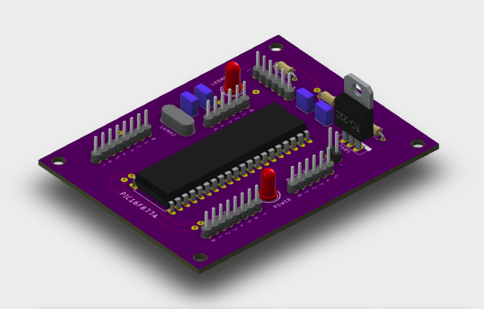
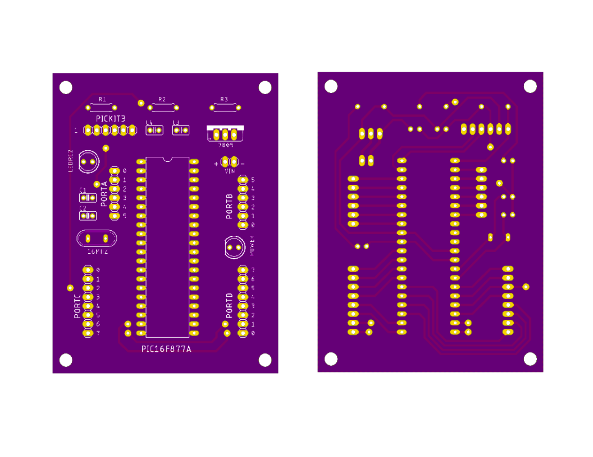

# PIC Development Board  
  

  
  

  
## PCB Layout (Top and Bottom View)

  
  

  
## License

This work is licensed under [GNU General Public License v3.0](https://github.com/atick-faisal/PIC16F877a/blob/master/LICENSE).
